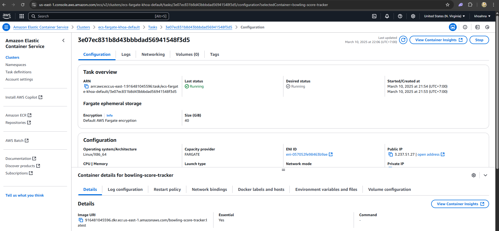

# Bowling Score Tracker Application
### Overview
This is a **Bowling Score Tracker** application built with **NextJS**, **TypeScript**, and **TailwindCSS**. It tracks the scores of multiple players across 10 frames, calculates the total score, and highlights the winner.

The requirements is at `./EN-Bowling Score Tracker.pdf`

For detail rule of Bowling game, please go to: https://youtu.be/E2d8PizMe-8?si=2xkGsgne6ayL5ay6

### Features
- Main player can enter name and the names of up to 4 other players so that we can start a game
- Player enter scores for each frame and each other player so that total score can be calculated
- Calculate total score for each player automatically based on standard bowling rules
- See summary of scores for all players after each frame so that I can track the progress of the game
- See the final scores and the winner at the end of the game


### Detail tech stack
- **NextJS**, **TypeScript** and **TailwindCSS**: Frontend Develop
- **Jest** (ts-jest with swc): Unit Testing
- **Cypress**: E2E Testing (User Simulation)
- **Docker**: For application bundle and deployment
- **AWS ECS**: Production deployment for scaling, granular control of the application and security.
- **Github Actions**: CICD for faster development process.
- **Fastify**: Backend server for storing bowling scores in PostgreSQL
- **PostgreSQL**: Database for storing game history and player records

---

## Table of Contents
1. [Prerequisites](#prerequisites)
2. [Setup](#setup)
3. [Folder Structure](#folderstructure)


---

## Prerequisites

Before setting up the project locally, ensure you have the following installed:

- **Node.js** (>=18.18)

If you don’t have Node.js and npm installed, you can download and install them from [Node.js](https://nodejs.org/).

**NOTE**: The developer using **Windows 11** to develop this app. If there is MacOS or Linux user setup and stuck, please contact the developer for help. 

---

## Setup

Follow these steps to get the application running locally:

#### 1. Clone the Repository
First, clone the repository to your local machine:

```bash
git clone https://github.com/anhkhoa93/bowling-score-tracker.git
```
#### 2. Navigate to the project directory
```
cd bowling-score-tracker
```

#### 3. Install Dependencies
```
npm install
```

#### 4. Run the application
```
npm run dev
```
Access the application at:
```
http://localhost:3000/
```

#### 5. For unit testing
- Unit Testing using **Jest** with TypeScript:
```
npm test
```


#### 6. For end-to-end testing (user simulation) with **Cypress**
- Make sure `npm run dev` is already run in different terminal
- Install Cypress (If Not Installed)
```
npm install --save-dev cypress
```
- Open Cypress Test Runner > E2E Testing
```
npx cypress open
```


- Run Cypress Tests in Headless Mode
```
npx cypress run
```


## FolderStructure
```
bowling-score-tracker/
├── src/app                         # Source code for the application
│   ├── components/                 # Reusable components (e.g., ScoreTracker, UserManagement)
│   │   ├── ScoreTracker.tsx        # ScoreTracker component
│   │   ├── UserManagement.tsx      # User management component
│   ├── __tests__/                  # Jest unit tests
│   │   ├──── *.test.tsx            # Unit test for the application
│   ├── styles/                     # styles (e.g., Tailwind, global CSS)
│   └── page.tsx                    # Main app component (if not using Next.js pages)
│   ├── e2e/                        # Cypress end-to-end tests
│   │   ├── bowlingScore.cy.js      # Cypress test for adding players and starting the game, run the game to the end
├── Dockerfile                      # Dockerize the application
├── docker-compose.yml              # Docker compose to run the component in production mode
├── package.json                    # npm dependencies and scripts
├── tsconfig.json                   # TypeScript configuration
├── tailwind.config.js              # Tailwind CSS configuration
├── jest.config.js                  # Jest configuration for unit tests
└── cypress.json                    # Cypress configuration
```

## Production Deployment
#### Overview
The idea of deployment is to gain full control of the services and we can control scaling, security aspect of the production application

```
**NOTE**: Since the time is limited so in this scope we handling scalling and part of security only (Environment setup, AWS IAM, AWS ECS, AWS ECR). 
```

### 1. Run Docker to build the image
```
docker build --build-arg NODE_ENV='production' -t bowling-score-tracker . --no-cache
```

### 2. Create AWS User account that can execute ECS and ECR, then push image to ECR
- Create an IAM User that have permission AmazonEC2ContainerRegistryPowerUser

- Create an ECR Repository
```
aws ecr create-repository --repository-name <your-repo-name>
```
- Authenticate Docker Client
```
$ECR_LOGIN = aws ecr get-login-password --region <your-region>   
aws ecr get-login-password --region <your-region> | docker login --username AWS --password-stdin <your-account-id>.dkr.ecr.<your-region>.amazonaws.com
```

- Tag the image
```
docker tag <your-image-name>:latest <your-account-id>.dkr.ecr.<your-region>.amazonaws.com/<your-repo-name>:<your-image-tag>
```
- Push the image to ECR
```
docker push <your-account-id>.dkr.ecr.<your-region>.amazonaws.com/<your-repo-name>:<your-image-tag>
```


### 3. Create ECS with task definition (run from the ECR's image) so we can scale application base on production needs
- Full detail at: https://docs.aws.amazon.com/AmazonECS/latest/developerguide/create-service-console-v2.html


### 4. Verify application running
- Since the IP might change, need to request per deployment

- Future plan is register a domain name, the ALB need to be deloyed and link with DNS and point to the ECS cluster. Then we can use domain name to access. 
```
http://3.237.51.27:3000/
```


### FUTURE DEVELOPMENT
- Register a custom domain
- Create Certificate (CA) for HTTPS, link the Certificate to ALB with the domain
- CICD with github action (each merge from develop to master will trigger deployment of ECS), possible run with cannary deployment approach
- Application should store the scores securely. So the server components should write the data into a database (redis/postgresql)
- If the player input the point already, they cannot make change to the score array. So there is 2 approachs:
  - Store each score using sever component, and check the server record each time new score is set
  - Client side render only, but hash the last state of score array, and add new score, then rehashing the structure to make sure each change is immutable (blockchain approach)

---

## Recent Optimizations and Improvements

### Performance Optimizations
- Implemented dynamic imports with loading states for better code splitting and improved initial load time
- Added memoization for components and event handlers to prevent unnecessary re-renders
- Enabled SWC minification for improved production build performance
- Implemented React strict mode for better development practices
- Added compiler option to remove console logs in production

### Component Enhancements
- Created a dedicated ErrorDialog component for better error handling
- Refactored ScoreTracker component for better state management and performance
- Improved WinnerAnnouncement component with proper z-index and pointer events handling
- Enhanced UI with responsive design and better loading states

### Testing Improvements
- Added data-testid attributes for more reliable test targeting
- Improved Cypress test reliability by adjusting component interactions

### Code Quality
- Fixed lint errors throughout the codebase
- Improved type definitions for better TypeScript support
- Enhanced component props interfaces for better code maintainability
- Implemented proper error handling and user feedback mechanisms
- Created reusable CSS module system for consistent styling across components

### Backend Server
- Implemented a Fastify server to store bowling scores in PostgreSQL
- Created RESTful API endpoints for players, games, and scores
- Designed a normalized database schema with proper relationships
- Added data persistence for game history and player records

### Database Integration
- PostgreSQL database with tables for players, games, and game scores
- Proper indexing for optimized query performance
- Transaction support for data integrity
- API service for client-server communication
